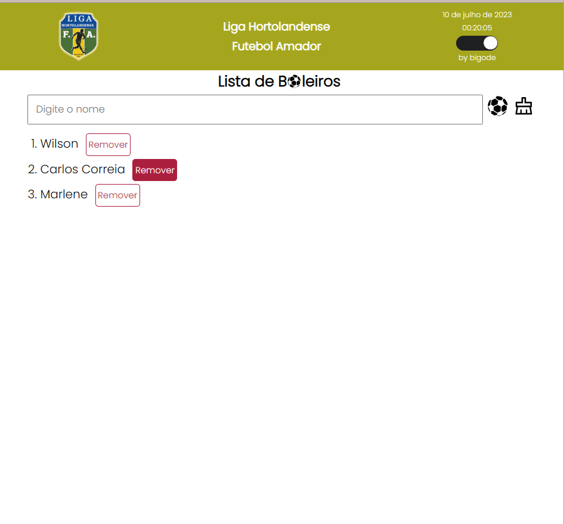

# Instruções de Desenvolvimento - Aplicação de Todo List

## Descrição da Aplicação

Este repositório contém uma aplicação desenvolvida em React.

- A aplicação permite gerenciar uma lista de pessoas, podendo adicionar e remover os integrantes

- Há uma proteção para a exclusão acidental da lista completa.

- A aplição permanece a lista via localStorage

- Foi Aplicado Theme providader para mudar as cores do Header

- Utilizada a biblioteca react icons para os icones

- Adicionada função para exibir a Data

- Adicionada função para exibir a Hora

